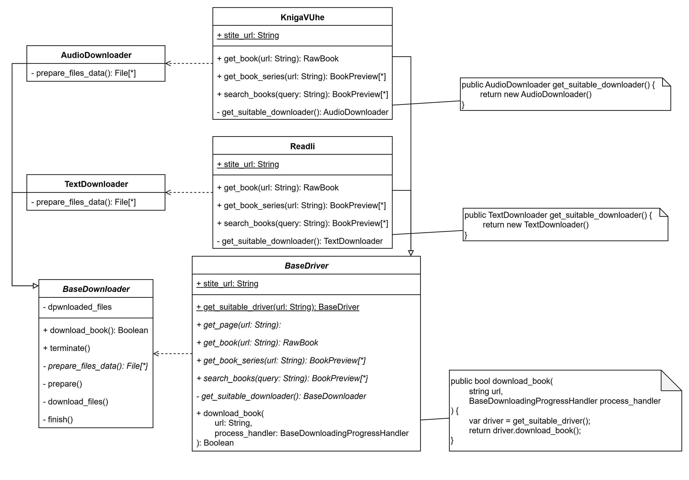
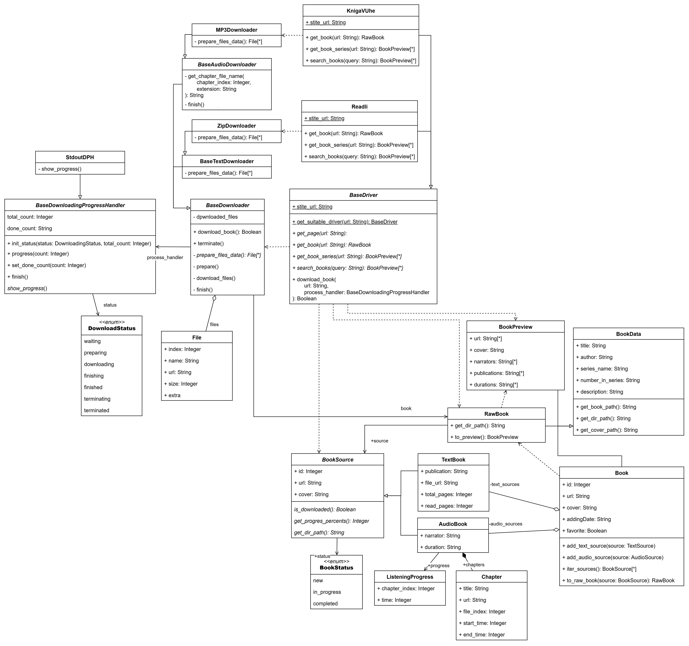

# Lab01

## Глосарий

`Driver` (драйвер) -- поставщик информации о книгах с конкретного источника(сайта).

`Downloader` (загрузчик) -- бизнес-логика для загрузки файлов книг.

## Описание проблемы:

Различные источники предоставляют разные форматы данных (текстовые книги/аудио книги), к тому же эти форматы сами по себе могут храниться в различных форматах. 

> Так, например, текстовые книги могут быть представлены единственным файлом в формате fb2/epub, но так же могут быть упакованы в архивы (zip/rar). Аудиокниги могут быть представлены отдельными mp3-файлами для каждой главы или одним файлом m3u8. Вариантов очень много.

Повляется необходимость выбирать подходящий загрузчик для каждого драйвера.

Проблема появляется при большом количестве источников с различными форматами данных, а так же при их добавлении, так как необходимо не только создать соответствующий загрузчик, но и прописать логику его выбора в основной программе.

## Решение

Для решения проблемы используется паттерн `Factory Method`. 

Выбор, какой из доступных загрузчиков инстанцировать, переходит из основной программы к каждому драйверу.

Таким образом, основная программа даже не знает о выборе загрузчика, и полностью полагается на драйвер.

Концептуально это решение можно описать с помощью диаграммы классов:

Базовый класс драйвера будет вызывать переопределенный метод `get_suitable_downloader` и скачивать книгу, используя полученный загрузчик.

## Реализация

Проект реализован на языке `Python`, из-за чего появится следующая особенность:

- метод `get_suitable_downloader` не будет абстрактным и не будет переопределяться в классах-наследниках. Вместо этого наследники будут обязаны оределить статический атрибут `downloader_factory: typing.Type[BaseDownloader]` из которого метод `download_book` в базовом классе и будет получать подходящий загрузчик.

Полная диаграмма классов, со всеми необходимыми для работы классами:

## Вывод

Внедрение паттерна `Factory Method` позволяет избавиться от прямой зависимости между клиентом и конкретными классами продуктов, что делает код более гибким и расширяемым. В данном случае, паттерн позволяет добавлять новые типы загрузчиков без изменения существующего кода, что упрощает поддержку и расширение функциональности приложения.
