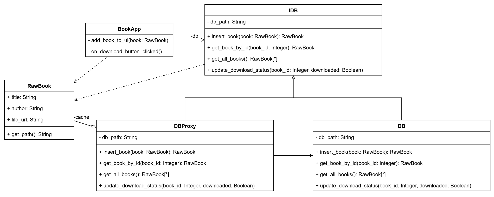
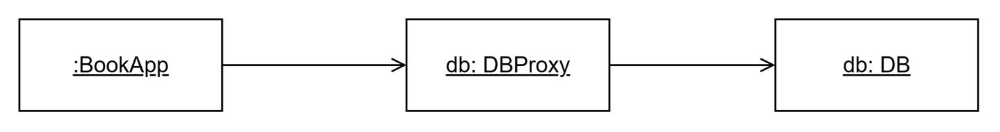

# Lab02

## Описание проблемы

Запросы к базе данных могут быть затратными по времени.

## Решение

Для решения проблемы можно кэшировать результаты запросов.

Для этого будем использоватть паттерн `Proxy`, который позволит создать дополнительный слой между базой данных и клиентом. На этом слое и будет выполняться кэширование.

## Реализация

Полная диаграмма классов, со всеми необходимыми для работы классами:

`BookApp` -- Класс клиента. Он хранит ссылку на экземпляр класса реализующего интерфейс `IDB`.

Этим экземпляром может быть как оригинальный `DB`, так и прокси `DBProxy`.

Диаграмма объектов в этом случае будет следующией:

Класс проксти явлется посредником между клиентом и базой данных.

> В реализации без паттерна `Proxy` `BookApp` хранит ссылку на экземпляр класса `DB`. 

## Вывод

Внедрение паттерна `Proxy` в приложение ускорит работу приложения при больших объемах данных, при этом внедрение паттерна требует минимальных изменений в кодовой базе: необходим дополнительный класс, реализующий интерфейс `IDB`, и изменение всего одной строки кода в основной программе<b>*</b>, так как новый класс реализует тот же самый интерфейс, что и оригинальный класс `DB`.

> <b>*</b> -- достаточно поменять инициализируемый класс в 
