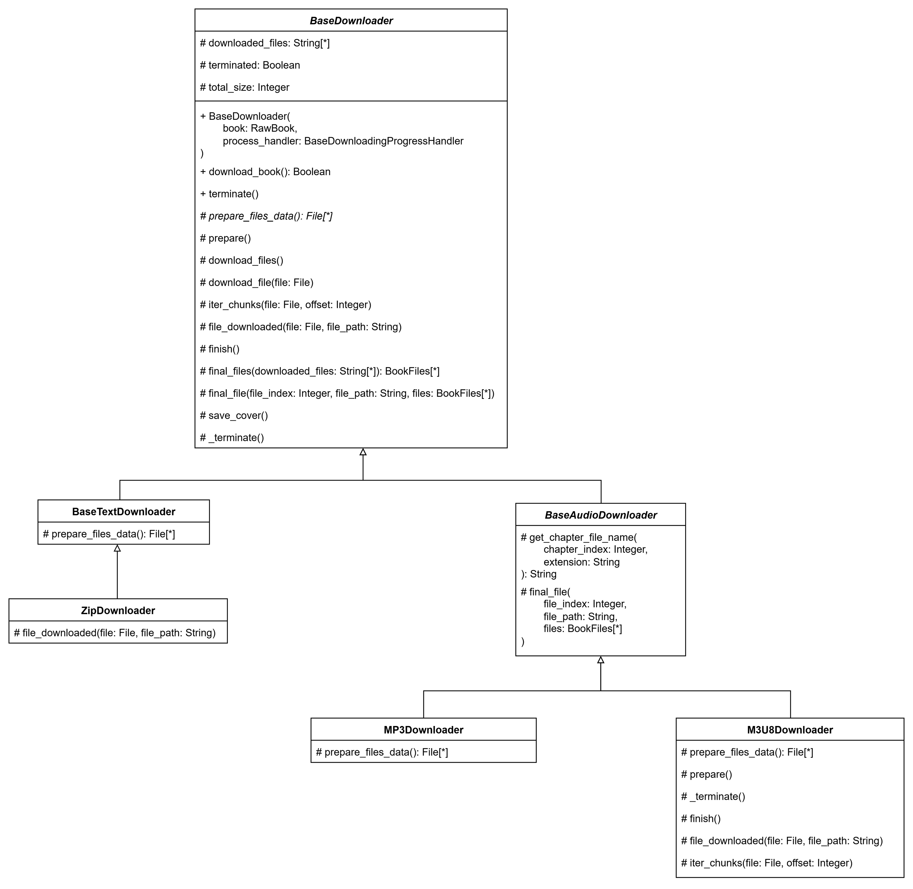
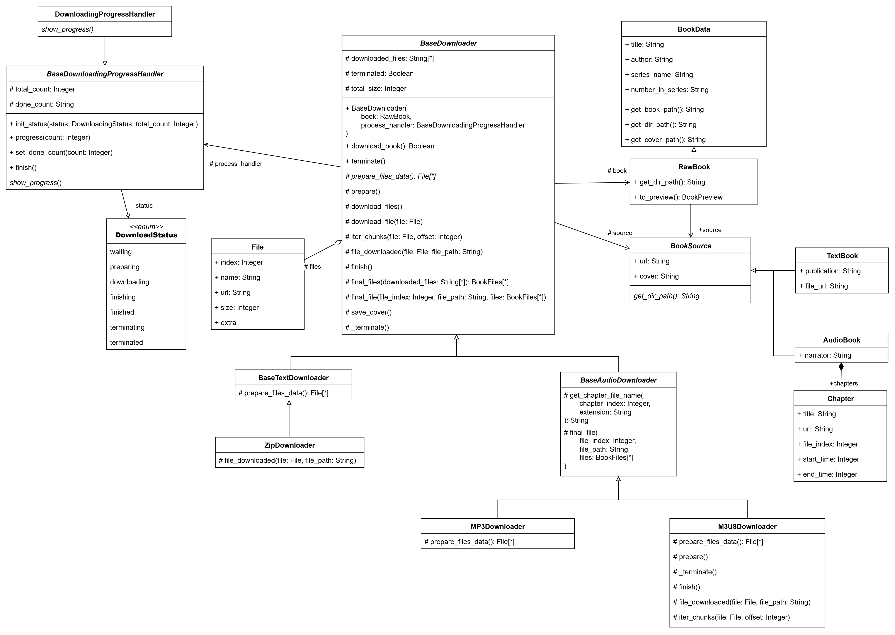

# Lab03

## Описание проблемы

Алгоритмы скачивания книг с различных источников могут отличаться незначительно и реализация всего алгоритма скачивания для каждого вида загрузчика приводит к дублированию огромного колличества кода.

## Решение

Для решения проблемы можно реализовать общий алгоритм скачивания в базовом классе, разделив его на этапы. 

Для этого будем использоватть паттерн `Template Method`, который позволит каждому наследнику изменить как весь алгоритм целиком, так и отдельные его части.

Концептуально диаграмму класов можно изобразить следующим образом:

## Реализация

Полная диаграмма классов, со всеми необходимыми для работы классами:

Загрузчики-наследники переопределяют отдельные этапы загрузки книги, а основная логика загрузки остается прописана в единственном месте -- в `BaseDriver`.

## Вывод

Использование паттерна `Template Method` позволило гибко модифицировать логику загрузки в классах наследниках, избегая дублирования кода.
