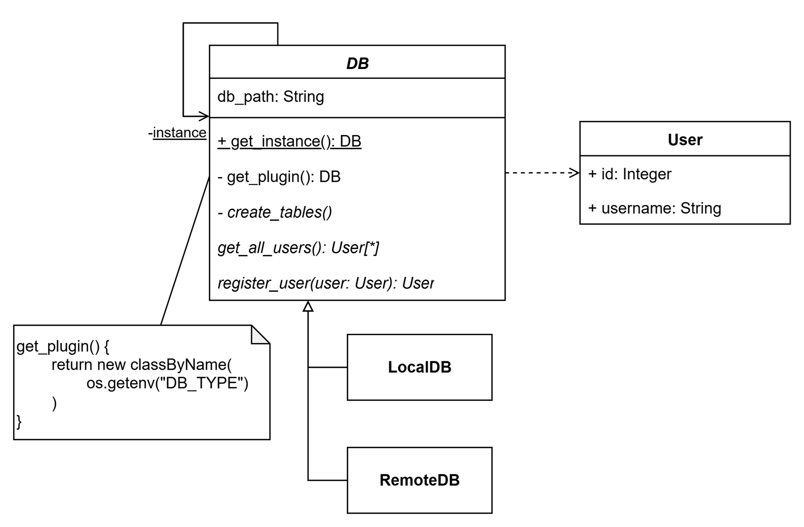

# Lab04

## Описание проблемы

Различные среды исполнения программы (локальная, продакшен) не просто используют разные пути к базам данных, но и разные СУБД, с различным синтаксисом запросов и возможностями. Требуется возможность переключаться между различными СУБД в зависимости от среды исполнения, без изменения кода программы.

## Решение

Для решения проблемы можно реализовать две имплементации интерфейса взаимодействия с базой данных. И выбирать конкретную реализацию при запуске программы, в зависимости от переменных окружения.

Для этого будем использоватть паттерн `Plugin`, который динамически выбирать нужную реализацию взаимодействия с базой данных в зависимости от конфигурации.

## Реализация

Диаграмма классов, со всеми необходимыми для работы классами:

Метод `get_plugin()` базового класса `DB` возвращает экземпляр выбранной реализации взаимодействия с базой данных.

> Базовый класс `DB` так же реализует паттерн `Singleton` -- хранит в себе единственный экземпляр реализации взаимодействия с базой данных и предоставляет доступ к нему через статический метод `get_instance()`. 

> **Реализация без паттерна**
> 
> В реализации без паттерна `Plugin` базовый класс `DB` не имеет метода `get_plugin()` и метод `get_instance()` возвращает hard-coded экземпляр реализации, для переключения на другую реализацию необходимо модифицировать исходный код. 

## Вывод

Использование паттерна `Plugin` позволяет изменить часть логики программы извне, избавляя от необходимости модифицировать исходный код.
